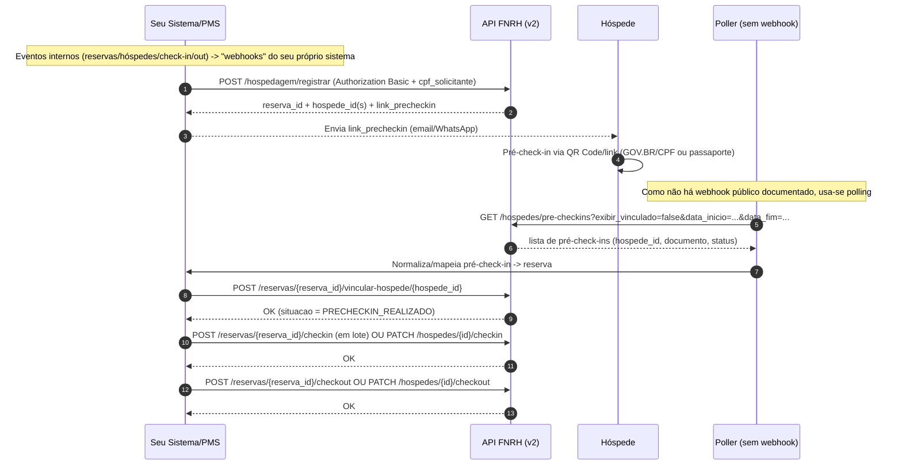

# Investigação técnica e operacional da FNRH Digital para integração de software

## Resumo executivo

O termo **FNRH**, no contexto de hotelaria e do “Ministério do Turismo”, refere-se à **Ficha Nacional de Registro de Hóspedes (FNRH) Digital** (não ao “Fundo Nacional de Recursos Hídricos”). A base normativa recente trata a “Plataforma FNRH Digital” como o sistema oficial para registro e gestão das fichas, incluindo integração com PMS via API e rotinas de pré-check-in/check-in/check-out. citeturn36view0turn42view2

Para integração de software, a documentação técnica oficial publicada no portal gov.br descreve uma **API REST v2** (documentação v2.3 datada de 07/04/2026) com **HTTPS/TLS 1.2+**, **JSON/UTF‑8** e **autenticação HTTP Basic** usando credenciais (“usuário” + “chave/token”) geradas no painel do sistema. A API expõe endpoints para **domínios (listas de valores)**, **reservas**, **pessoas**, **hóspedes**, **pré-check-ins**, **fichas** e um endpoint “all-in-one” (**POST /hospedagem/registrar**) para criar reserva e registrar hóspedes em uma única chamada. citeturn20view0turn27view0turn31view6turn39view0

Uma alternativa **totalmente manual (sem API)** é operar no **módulo gratuito para meios de hospedagem sem PMS**, que oferece gestão de reservas, QR Code e link para pré-check-in, geração de PDF para impressão, cadastro/gestão de hóspedes e consulta de fichas. Essa via manual **exige**: cadastro regular e ativo, designação do “Responsável pela FNRH” no cadastro oficial e acesso com conta gov.br. citeturn14view0turn24view1turn23view2turn23view4

Sobre **Cloudbeds**, há declaração pública (Help Center, 06/03/2026) de que a empresa **oferecerá integração direta** para sincronização de dados com o portal FNRH Digital (envio em check-in/check-out e ao atualizar dados do hóspede), mas com status descrito como “etapas finais de desenvolvimento” e previsão estimada para 1º trimestre de 2026 (o que pode estar desatualizado). Paralelamente, há documentação (fev/2026) indicando que o template de dados para Brasil **apoia coleta**, porém **não submete** aos sistemas governamentais (SERPRO). citeturn16view0turn15view1

A documentação oficial **não descreve webhooks/callbacks** da FNRH; na prática, o padrão de integração é **push** (seu sistema → API FNRH) e, quando necessário, **polling** para ler pré-check-ins e status das fichas. citeturn32view2turn17view8

## Escopo normativo do sistema FNRH Digital do entity["organization","Ministério do Turismo","brazil federal tourism ministry"]

No Brasil, “FNRH” (no âmbito do turismo) é a **ficha de registro de hóspede**; a Portaria MTur nº 41/2025 adota terminologia formal que diferencia: (a) a **Plataforma FNRH Digital** (“Plataforma”), (b) a **API** como meio de interoperabilidade com PMS, (c) a **chave de API** como credencial exclusiva do estabelecimento (usuário + token), e (d) o **log de erros de API** como registro de falhas de comunicação para diagnóstico. citeturn36view0turn13view1

A mesma portaria vincula o acesso e a operação regular à manutenção do cadastro no **entity["organization","Cadastur","brazil tourism registry"]**, estabelecendo também perfis e responsabilidades (responsável/supervisor/operador) para gestão dos usuários e configuração do estabelecimento. citeturn13view4turn36view0

Do ponto de vista de privacidade e segurança, a portaria define obrigações de governança e requisitos de proteção de dados (ex.: trilhas de auditoria e logs; medidas técnicas e administrativas; tratamento de menores; regras sobre comunicação de incidentes; elaboração de RIPD e submissão à **entity["organization","ANPD","brazil data protection authority"]** quando aplicável). Isso impacta diretamente como sua integração deve tratar credenciais, logs e dados pessoais no seu próprio sistema (ex.: minimização, controle de acesso, segregação por cliente, retenção e auditoria). citeturn13view5turn13view6turn36view1

## Fontes oficiais e estado atual da API

A trilha documental mais “operacional” para integração (em português e publicada pelo governo) é composta por:

- **Portaria MTur nº 41/2025** (base normativa; define API key, logs, conceitos de pré-check-in/check-in/checkout etc.). citeturn10view6turn36view0  
- **Documentação da API FNRH v2.3** (07/04/2026): especifica ambientes, autenticação, endpoints, payloads e padronizações (ISO para países e IBGE para municípios). citeturn20view0turn17view4turn17view5  
- **Changelog v2.2 → v2.3** (07/04/2026): explica mudanças recentes (sem quebra para integrações v2.2; retorno de `hospede_id` no POST de inclusão; padronização de paginação; padronização de “noshow”). citeturn25view1  
- **Guia de geração/rotação de chave de API** (PDF curto): orienta como entrar no painel e obter credenciais para o PMS. citeturn21view1turn21view2  
- **Orientação de ambiente de homologação** (Gov.br staging): indica uso de ambiente “staging” do gov.br para testes. citeturn22view0turn22view2  
- **Manual do Módulo Hospedagem (sem PMS)**: instruções de operação manual (QR Code, reservas, fichas, personalização). citeturn23view2turn23view4turn23view7  
- **FAQ oficial**: confirma que a integração para PMS ocorre via API e reforça necessidade de monitorar logs de erros da API; detalha passos para operar sem PMS; informa prazo/obrigatoriedade e custos (plataforma e API sem taxa). citeturn14view0turn36view2  
- **Notícias oficiais (gov.br e Serpro)**: contextualizam prazo (até 20/04/2026), operação via QR Code/link, uso de dados do gov.br e parceria com o **entity["organization","Serpro","brazil federal it company"]**. citeturn42view2turn42view0  

Fontes primárias (URLs) para consulta direta (em ordem de utilidade para integração):

```text
https://www.gov.br/turismo/pt-br/centrais-de-conteudo-/publicacoes/atos-normativos-2/2025/portaria-mtur-no-41-de-14-de-novembro-de-2025
https://www.gov.br/turismo/pt-br/acesso-a-informacao/acoes-e-programas/programas-projetos-acoes-obras-e-atividades/ficha-nacional-de-registro-de-hospedes/documentacao-api-v2-3-producao.pdf
https://www.gov.br/turismo/pt-br/acesso-a-informacao/acoes-e-programas/programas-projetos-acoes-obras-e-atividades/ficha-nacional-de-registro-de-hospedes/changelog-api-v2-3.pdf
https://www.gov.br/turismo/pt-br/acesso-a-informacao/acoes-e-programas/programas-projetos-acoes-obras-e-atividades/ficha-nacional-de-registro-de-hospedes/modulo-meio-de-hospedagem/meios-de-hospedagem-com-pms/chave_api.pdf
https://www.gov.br/turismo/pt-br/acesso-a-informacao/acoes-e-programas/programas-projetos-acoes-obras-e-atividades/ficha-nacional-de-registro-de-hospedes/modulo-meio-de-hospedagem/meios-de-hospedagem-com-pms/AmbienteHomologaoOrientao.pdf
https://www.gov.br/turismo/pt-br/acesso-a-informacao/acoes-e-programas/programas-projetos-acoes-obras-e-atividades/ficha-nacional-de-registro-de-hospedes/modulo-meio-de-hospedagem/meios-de-hospedagem-sem-pms/Manual_Modulo_Hospedagem.pdf
https://www.gov.br/turismo/pt-br/acesso-a-informacao/acoes-e-programas/programas-projetos-acoes-obras-e-atividades/ficha-nacional-de-registro-de-hospedes/faq
https://www.gov.br/turismo/pt-br/assuntos/noticias/faltam-10-dias-prazo-para-adotar-check-in-100-digital-termina-em-20-de-abril
https://www.serpro.gov.br/menu/noticias/noticias-2025/serpro-ficha-hospedes
https://myfrontdesk.cloudbeds.com/hc/pt-br/articles/19524667987355-Conformidade-Governamental-Brasil
https://myfrontdesk.cloudbeds.com/hc/en-us/articles/38046227239835-Use-Guest-Information-Templates-for-Government-Data-Compliance
```

## Especificação técnica da API

A seguir, consolido a estrutura técnica **conforme a documentação oficial v2.3** (com observações práticas quando a própria documentação mostra inconsistências pontuais de exemplo).

### Ambientes, protocolo e formato

A API v2 informa dois ambientes (Produção e Homologação) e impõe **HTTPS (TLS 1.2+)** e **JSON (UTF‑8)**. citeturn20view0

- Produção: `https://fnrh.turismo.serpro.gov.br/FNRH_API/rest/v2` citeturn20view0  
- Homologação: `https://hom-lowcode.serpro.gov.br/FNRH_API/rest/v2` citeturn20view0  

A própria documentação também apresenta exemplos com host alternativo `https://api.fnrh.gov.br/FNRH_API/rest/v2/...` (ex.: GET fichas). Isso sugere um alias/DNS adicional; para integração “firme”, vale confirmar com o órgão qual host deve ser usado em produção no seu caso. citeturn33view2

### Autenticação e headers obrigatórios

O método de autenticação é **HTTP Basic Authentication** (RFC 7617), com o header:

- `Authorization: Basic base64(usuario:senha)`  
- `Content-Type: application/json` citeturn20view0turn27view6

A documentação trata a credencial como “usuário” + “senha/chave/token” (gerada no painel). Exemplo de erro 401 documentado:

```json
{ "erro": "Unauthorized", "mensagem": "Credenciais inválidas ou ausentes", "codigo": 401 }
```

citeturn29view4

Além disso, alguns endpoints exigem o header **`cpf_solicitante`** (CPF válido de quem está realizando a operação/consulta), especificamente para fins de auditoria (“rastreia quem fez o acesso”). Isso aparece explicitamente em endpoints de Pessoas (POST /pessoas; GET por documento) e no endpoint completo de Hospedagem (POST /hospedagem/registrar). citeturn38view1turn27view0

### Domínios (listas de valores válidos)

Os endpoints de domínios são fundamentais para **evitar erro 400 (VALIDATION)** por enviar IDs inválidos. Principais rotas documentadas:

- `GET /dominios/fnrh/meios_transporte`
- `GET /dominios/fnrh/motivos_viagem`
- `GET /dominios/hospedes/situacoes`
- `GET /dominios/pessoas/generos`
- `GET /dominios/pessoas/opcao_deficiencia`
- `GET /dominios/pessoas/racas`
- `GET /dominios/pessoas/tipos_deficiencia`
- `GET /dominios/pessoas/tipos_documento`
- `GET /dominios/reservas/situacoes`
- `GET /dominios/fichas/situacoes` citeturn39view0turn38view0

A recomendação prática é: **cachear** essas listas localmente (com TTL e refresh) e sempre mapear seus valores internos para os `id` aceitos na FNRH antes de enviar dados ao governo.

### Reservas

A API de Reservas suporta listagem paginada com filtros e operações de ciclo de vida. A paginação é feita por `page_number` e, na documentação, **a primeira página é 1** (apesar de haver exemplos antigos/isolados com 0). A quantidade por página aparece no bloco `pagination` do response. citeturn31view2turn25view1

Endpoints centrais (v2):

- `GET /reservas` (filtros: `page_number`, `situacao`, `codigo_reserva`, `data_entrada`, `data_saida`) citeturn31view2turn34view0  
- `POST /reservas` (criação) citeturn37view4  
- `GET /reservas/{id}` (detalhes; inclui `link_precheckin` quando aplicável) citeturn17view1  
- `PUT /reservas/{id}` (atualização) citeturn30view6  
- `DELETE /reservas/{id}` (restrição: “apenas CRIADA”; não delete com check-in realizado) citeturn30view5  
- `POST /reservas/{reserva_id}/cancelar` (cancelamento) citeturn31view3  
- `GET /reservas/{reserva_id}/hospedes` (lista hóspedes associados) citeturn31view3turn31view4  
- `POST /reservas/{reserva_id}/hospedes` (adiciona pessoa na reserva; cria hóspede a partir de `pessoa_id`) citeturn30view1turn25view1  
- `POST /reservas/{reserva_id}/checkin` (check-in em lote)
- `POST /reservas/{reserva_id}/checkout` (check-out em lote)
- `POST /reservas/{reserva_id}/noshow` (no-show em lote) citeturn30view2turn30view3turn32view3  
- `POST /reservas/{reserva_id}/vincular-hospede/{hospede_id}` (vincula pré-check-in “não vinculado” à reserva) citeturn32view0  

Observação operacional importante: a documentação indica que, quando você envia data/hora em alguns endpoints de evento (ex.: checkout em lote), o body pode ser **texto (string ISO‑8601 com “Z”)** em vez de JSON (não um objeto). citeturn30view3turn38view1

### Pessoas

“Pessoa” é o cadastro base (documento + dados pessoais + contato/endereço) e pode existir antes de virar “Hóspede” em uma reserva.

Rotas principais:

- `POST /pessoas` (cria pessoa; exige `cpf_solicitante` no header) citeturn30view8turn38view2  
- `GET /pessoas/{id}` (detalha pessoa) citeturn40view2  
- `GET /pessoas/documento/{tipo}/{numero}` (busca por documento; CPF ou Passaporte; exige `cpf_solicitante`) citeturn20view3turn31view0  

Campos relevantes documentados para POST /pessoas incluem: nome, nome_social, `PaisNacionalidade_id`, gênero, data de nascimento, raça, deficiência, documento (CPF/passaporte), email/telefone, `PaisResidencia_id`, CEP e componentes de endereço; quando `PaisResidencia_id = "BR"`, o município/UF usa código IBGE. citeturn38view3turn17view5

### Hóspedes e pré-check-ins

O ciclo operacional envolve:

- Pré-check-in (hóspede preenche via QR Code/link)
- Vinculação desse pré-check-in a uma reserva (quando aplicável)
- Check-in / check-out (individual ou em lote)
- No-show (individual ou em lote)

Endpoints baseados em “Hóspede”:

- `GET /hospedes/pre-checkins` (lista pré-check-ins via QR Code; filtros como `exibir_vinculado`, intervalo de datas e documento) — exemplo completo com URL base oficial aparece na documentação. citeturn35view2turn32view2  
- `PATCH /hospedes/{hospede_id}/checkin` (check-in individual)
- `PATCH /hospedes/{hospede_id}/checkout` (check-out individual)
- `PATCH /hospedes/{hospede_id}/noshow` (no-show individual; padronizado como `noshow`, sem hífen) citeturn30view7turn38view1turn25view1  

### Hospedagem “all-in-one” (principal para integração rápida)

O endpoint **`POST /hospedagem/registrar`** é descrito como o mais completo: cria a reserva e registra todos os hóspedes em uma única operação, com header obrigatório `cpf_solicitante`. citeturn31view6turn27view0

No exemplo de response do fluxo completo, a documentação mostra que a resposta pode incluir:

- dados da reserva (incluindo `reserva_id`, `numero_reserva`, `situacao_reserva_id`, datas e `link_precheckin`)
- array `dados_hospedes` com `hospede_id` e status (ex.: `PRECHECKIN_PENDENTE`) citeturn20view4  

### Fichas (consulta e acompanhamento)

O endpoint **`GET /fichas`** lista fichas registradas para o meio de hospedagem, com paginação e filtros (status, datas, documento etc.). Ele é útil para auditoria operacional e para conciliar “o que seu sistema acha que enviou” versus “o que o governo registrou”. citeturn17view8turn27view3

### Padronizações de país e cidade

A documentação v2 adota:

- `PaisNacionalidade_id` e `PaisResidencia_id`: códigos **ISO 3166‑1 alpha‑2** (ex.: “BR”, “DE”, “AR”), com validação mais rigorosa e retorno de erro 400 para código inválido. citeturn17view4turn20view7turn28view1  
- `cidade_id` (quando residência no Brasil): código numérico do **entity["organization","IBGE","brazil statistics institute"]**. citeturn17view5turn20view6  

A lista oficial completa dos países é delegada à documentação da **entity["organization","ISO","international standards body"]** (não há endpoint de países na API v2.3). citeturn17view4turn20view6  

### Rate limits e códigos de erro

A documentação v2.3 **não publica limites numéricos de taxa** (ex.: X req/min). Em vez disso, recomenda como boa prática “implementar rate limiting nas requisições”. citeturn11view1turn38view0

Códigos de status documentados explicitamente incluem: 200, 400 (inclui 400 VALIDATION), 401, 403, 404, 500. citeturn29view3turn20view5  

## Guia prático de integração com exemplos de código

Assunções explícitas (porque você não especificou seu stack e o tipo exato do seu programa):
1) Seu programa age como um “PMS/Orquestrador” que cria/atualiza reservas, gerencia hóspedes e registra check-in/out.  
2) Você consegue armazenar credenciais por estabelecimento (multi-tenant) e executar jobs agendados (polling).  
3) Você pode expor endpoints internos (webhooks) para receber eventos do seu próprio front/integrações e disparar envio à FNRH.

### Pré-requisitos administrativos antes do primeiro request

A integração técnica depende de ações “fora do código”:

- Estar regular no cadastro e **designar o CPF do “Responsável pela FNRH”** no cadastro oficial (há passo a passo com telas e encaminhamento para análise). citeturn14view0turn24view1  
- Acessar o sistema com conta gov.br de Administrador/Supervisor e gerar a credencial no menu de “Chaves de API” (o painel exibe “Usuário” e “Chave”, e há opção de “Gerar nova chave” para rotação). citeturn21view0turn21view1turn21view2  
- Definir se você vai testar em Homologação e, se sim, preparar conta/fluxo de acesso no “Gov.br staging” conforme orientação publicada. citeturn20view0turn22view0  

### Estratégia de integração recomendada

Existem dois desenhos práticos, ambos oficiais:

**Estratégia A (preferencial quando você tem dados completos):** usar `POST /hospedagem/registrar` e enviar reserva + todos hóspedes de uma vez. A documentação chama isso de “endpoint mais completo”, e ele devolve IDs e link de pré-check-in, reduzindo número de chamadas e pontos de falha. citeturn31view6turn20view4

**Estratégia B (mais flexível/gradual):** criar/atualizar reserva e operar hóspedes por etapas:
1) `POST /reservas`  
2) para cada hóspede: `GET /pessoas/documento/...` (se não existir) → `POST /pessoas` → `POST /reservas/{reserva_id}/hospedes`  
3) se o hóspede tiver feito pré-check-in “de balcão”: `GET /hospedes/pre-checkins` → `POST /reservas/{reserva_id}/vincular-hospede/{hospede_id}`  
4) check-in/out individual (PATCH hóspede) ou em lote por reserva (POST reserva). citeturn37view4turn32view0turn32view2turn30view2

A documentação mais recente (changelog v2.3) ainda melhora o fluxo B ao retornar explicitamente `hospede_id` no POST de inclusão de hóspede na reserva, reduzindo chamadas extras. citeturn25view1

### Mapeamento de dados (seu modelo → FNRH)

A FNRH exige padronizações que normalmente não existem “por padrão” em PMS genérico. O seu mapeamento mínimo deve contemplar:

- **Documento**: CPF ou passaporte (`tipo_documento_id`, `numero_documento` sem caracteres especiais). citeturn39view0turn38view3  
- **Nacionalidade**: `PaisNacionalidade_id` em ISO 3166‑1 alpha‑2; **não** enviar texto livre. citeturn28view1turn17view4  
- **Residência** (especialmente para estrangeiros): `PaisResidencia_id` em ISO; quando BR, usar `cidade_id` (IBGE) e `estado_id` (UF). citeturn38view3turn17view5  
- **Motivo da viagem** e **meio de transporte**: usar os domínios (IDs aceitos) e definir quando coletar (no pré-check-in, no balcão, ou no check-in). citeturn38view0turn31view5  
- **Menores**: associar dependentes ao responsável (documentação menciona `responsavel_id` em payloads de hóspede). citeturn31view5turn26view0  

### Autenticação: exemplo em Python

Exemplo mínimo (requests) para listar motivos de viagem (domínio), usando Basic Auth e JSON:

```python
import os
import requests
from requests.auth import HTTPBasicAuth

BASE_URL = os.getenv("FNRH_BASE_URL", "https://fnrh.turismo.serpro.gov.br/FNRH_API/rest/v2")
USER = os.getenv("FNRH_USER")
TOKEN = os.getenv("FNRH_TOKEN")  # a "chave" gerada no portal

resp = requests.get(
    f"{BASE_URL}/dominios/fnrh/motivos_viagem",
    auth=HTTPBasicAuth(USER, TOKEN),
    headers={"Content-Type": "application/json"},
    timeout=30,
)
resp.raise_for_status()
print(resp.json())
```

Pontos críticos de produção (recomendação):
- aplique rate limiting no cliente (a própria doc recomenda) e retries com backoff para 500; citeturn11view1  
- trate 401/403 como erro de credencial/permissão e dispare rotação/validação; citeturn29view4turn29view3  
- logue `request_id` interno e correlacione com logs de erros da API no painel, quando houver. citeturn36view0turn36view2  

### Criação de pessoa: exemplo em JavaScript/Node

A doc v2.3 inclui exemplo em Node/axios para gerar Authorization Basic; aqui vai uma versão prática com `fetch` (Node 18+), incluindo `cpf_solicitante`:

```js
import process from "node:process";

const BASE_URL = process.env.FNRH_BASE_URL ?? "https://fnrh.turismo.serpro.gov.br/FNRH_API/rest/v2";
const USER = process.env.FNRH_USER;
const TOKEN = process.env.FNRH_TOKEN;
const CPF_SOLICITANTE = process.env.FNRH_CPF_SOLICITANTE; // CPF do responsável/operador (conforme regra do órgão)

function basicAuthHeader(user, token) {
  const b64 = Buffer.from(`${user}:${token}`, "utf8").toString("base64");
  return `Basic ${b64}`;
}

async function criarPessoa(pessoa) {
  const resp = await fetch(`${BASE_URL}/pessoas`, {
    method: "POST",
    headers: {
      "Content-Type": "application/json",
      "Authorization": basicAuthHeader(USER, TOKEN),
      "cpf_solicitante": CPF_SOLICITANTE,
    },
    body: JSON.stringify({ pessoa }),
  });

  if (!resp.ok) {
    const text = await resp.text();
    throw new Error(`FNRH erro ${resp.status}: ${text}`);
  }
  return resp.json(); // esperado: { pessoa_id: "uuid" } (conforme doc)
}

// Exemplo mínimo de payload (ajuste campos conforme seus dados e domínios)
await criarPessoa({
  nome: "MARIA APARECIDA DA LUZ",
  nome_social: "",
  PaisNacionalidade_id: "BR",
  genero_id: "MULHER",
  data_nascimento: "1988-09-08",
  raca_id: "PARDA",
  deficiencia_id: "NAO",
  tipo_deficiencia_id: "",
  numero_documento: "12345678901",
  tipo_documento_id: "CPF",
  email: "maria@email.com",
  telefone: "11999999999",
  PaisResidencia_id: "BR",
  cep: "01310100",
  logradouro: "Avenida Paulista",
  numero: "1000",
  complemento: "Apto 101",
  bairro: "Bela Vista",
  cidade_id: 3550308,
  estado_id: "SP",
});
```

Esse fluxo (POST /pessoas) e o GET por documento explicitam a necessidade do header `cpf_solicitante` para auditoria. citeturn38view1turn20view3

### Pré-check-ins: “entrada” no seu sistema (sem webhooks oficiais)

A documentação oficial descreve pré-check-in via **QR Code/link** e fornece endpoint para listagem paginada de pré-check-ins. Não há menção a webhooks da FNRH; portanto, a prática é **polling**. citeturn26view0turn35view2turn32view2

Recomendação operacional (sem afirmar que é exigência do órgão): rode um job a cada X minutos em cada propriedade para:

1) chamar `GET /hospedes/pre-checkins?exibir_vinculado=false&data_inicio=...&data_fim=...`  
2) mapear `numero_documento`/`tipo_documento` contra sua reserva (ou seu CRM de hóspedes)  
3) vincular com `POST /reservas/{reserva_id}/vincular-hospede/{hospede_id}` citeturn32view0turn32view2

### Testes em Homologação e checklist de implantação

O que dá para validar tecnicamente em Homologação (sem depender de suposições):

- seu Basic Auth funciona (401 vs 200); citeturn29view4  
- payloads passam por validação (400 VALIDATION), principalmente ISO/IBGE e domínios; citeturn29view3turn20view7  
- paginação consistente (notas do changelog); citeturn25view1  
- fluxo “all-in-one” retorna IDs e link de pré-check-in; citeturn20view4  
- vinculação de pré-check-in e atualização de status; citeturn32view0  

Checklist de produção (recomendação técnica):
- vault/secret manager para `USER` e `TOKEN`, com rotação e trilha de auditoria; a própria doc recomenda não expor credenciais, usar variáveis de ambiente e rotacionar. citeturn11view1turn21view2  
- validação local forte: ISO 3166, IBGE cidade/UF, formatos de data (ISO 8601), números de documento “sem máscara”; citeturn20view7turn38view3  
- idempotência local: guardar o “de/para” (`reserva_id`, `pessoa_id`, `hospede_id`) e impedir duplicação;  
- monitoramento: correlacionar falhas do seu conector com “log de erros da API” no portal (tem conceito normativo e recomendação no FAQ). citeturn36view0turn36view2  

## Alternativa manual sem API

Quando não há PMS ou quando você quer uma operação “100% manual/sem integração”, a solução oficial é operar no **módulo de meio de hospedagem sem PMS**, descrito como caminho para gerenciar reservas e registros manualmente. citeturn14view0turn23view4

### Procedimento manual mais completo (o “mais manual”)

Fluxo consolidado a partir do manual do módulo e do FAQ:

1) **Pré-requisito**: cadastro regular e **designação do CPF do Responsável pela FNRH** no cadastro oficial (há um passo a passo específico com telas e encaminhamento para análise). citeturn24view1turn14view0  
2) **Acesso**: entrar no portal do módulo com conta gov.br do responsável. citeturn14view0  
3) **Divulgação do pré-check-in**: no painel, acessar QR Code do hotel e compartilhar o link/QR (pode ser enviado por e-mail/WhatsApp; há opção de gerar PDF para impressão). citeturn23view2turn23view3  
4) **Reservas**: criar/gerenciar reservas manualmente, com filtros e acesso aos detalhes; há funções rápidas como “adicionar hóspede”, “alterar reserva”, “gerar QR Code da reserva” e “cancelar”. citeturn23view4turn23view5  
5) **Hóspedes**: cada hóspede maior de 18 preenche sua ficha; menores entram como dependentes do responsável (descrição oficial no módulo hóspede). citeturn26view0  
6) **Check-in assistido**: se o hóspede não conseguir preencher, a recepção pode fazer “preenchimento assistido”; a FAQ afirma que há validação de CPF e data de nascimento em tempo real com a **entity["organization","Receita Federal","brazil federal revenue service"]**, e inconsistências levam à rejeição. citeturn36view2  
7) **Fichas**: consultar listagem, status e histórico das fichas no módulo “Fichas”. citeturn23view7  

### Formulários, importação CSV/Excel e validações

- **Formulário obrigatório identificado**: preenchimento/atualização do campo “Responsável pela FNRH” no cadastro oficial (há PDF específico). citeturn24view1  
- **Uploads permitidos (no manual do módulo)**: upload de **termos/condições em PDF** e do **logo do estabelecimento** (PNG/JPG/JPEG/WEBP) para personalização da jornada do hóspede. citeturn23view6  
- **CSV/Excel**: nos documentos oficiais analisados para o módulo “sem PMS”, **não foi encontrada** especificação de importação CSV/Excel de reservas/hóspedes; a operação é via UI e via QR Code/link para pré-check-in. (Isso não prova inexistência em todo o ecossistema, mas indica ausência de documentação pública de formato de importação.) citeturn12view0turn12view1turn23view4  

## Cloudbeds e a adaptação do ecossistema de PMS

A entity["company","Cloudbeds","hospitality pms company"] publicou (06/03/2026) que **pretende oferecer integração direta** para sincronizar automaticamente os dados de registro de hóspedes com o portal FNRH Digital e que o envio ocorreria em check-in, check-out e ao atualizar dados do hóspede. O mesmo texto indica que a integração estava em “etapas finais de desenvolvimento” com disponibilidade estimada para o 1º trimestre de 2026, e que guias seriam publicados quando disponível. citeturn16view0turn41search0

Por outro lado, um artigo técnico de fev/2026 sobre “Guest Information Templates” afirma que, para o Brasil, o template “collects guest data for FNRH”, mas **não envia dados ao sistema governamental (SERPRO)** naquele recurso específico. Isso sugere que, historicamente recente, a Cloudbeds estava pelo menos viabilizando **coleta estruturada** dos campos exigidos, ainda que a submissão automática pudesse estar em rollout separado. citeturn15view1

Se você precisa integrar “já” com Cloudbeds (antes de uma integração nativa ficar confirmadamente disponível), o desenho técnico típico é: **middleware** que consome eventos/dados do PMS e faz chamadas à API FNRH v2, cuidando de mapeamento ISO/IBGE/domínios, idempotência, retries e auditoria. Esse desenho é compatível com o modelo “padrão ouro” citado pelo próprio governo (integração via API para evitar retrabalho). citeturn14view0turn20view0

## Questões em aberto e comparativo automatizado vs manual

### Questões que você deve confirmar com o órgão antes de fechar a integração

A documentação pública cobre bastante, mas alguns itens críticos para “produção de verdade” tendem a depender de confirmação operacional:

- Qual host oficial deve ser usado em produção no seu caso (há múltiplas referências em documentos: `fnrh.turismo.serpro.gov.br` e exemplos com `api.fnrh.gov.br`). citeturn20view0turn33view2  
- Existe **limite de requisições** por credencial/IP? Se sim, qual política e qual retorno esperado (429 não aparece na documentação v2.3). citeturn11view0turn11view1  
- Quais endpoints exigem `cpf_solicitante` e se há regras de vinculação desse CPF ao estabelecimento/perfil (a doc marca como obrigatório em alguns endpoints, mas convém confirmar a abrangência). citeturn38view2turn27view0  
- SLA de disponibilidade do ambiente de produção/homologação, janela de manutenção e canal oficial de suporte técnico (ex.: como registrar chamados e como anexar logs do seu conector).  
- Política de retenção/anonymização “do lado do governo” e expectativas de retenção no seu sistema (a portaria fala em prazos e detalhamento posterior por portaria específica). citeturn36view1  
- Requisitos de segurança adicionais para o seu conector (ex.: IP allowlist, uso obrigatório de mTLS, requisitos de logging/audit) — não descritos explicitamente na doc pública.  
- Volume esperado (reservas/dia, hóspedes/dia) para dimensionar polling de pré-check-ins e lotes de envio; embora o Serpro declare projeto para alto volume, isso não substitui quotas concretas. citeturn42view0  

### Comparativo: integração automática via API vs operação manual

| Critério | Integração via API (automática) | Operação manual (sem API) |
|---|---|---|
| Esforço inicial | Alto (desenvolvimento, validações, testes, operação) | Baixo a médio (treinamento/processo) |
| Esforço recorrente | Baixo (manutenção e monitoramento) | Alto (preenchimento e conferência diária) |
| Confiabilidade | Alta quando há idempotência, retries e validações | Depende do time; suscetível a erro humano |
| Latência | Quase em tempo real (event-driven) | Variável; depende da rotina de balcão |
| Custo direto | Governo informa que portal/API são gratuitos; custo fica na sua TI/PMS | Governo informa que portal é gratuito; custo maior em mão de obra citeturn36view2 |
| Segurança | Pode ser alta (segredos, auditoria, menor manuseio humano de dados) | Dados circulam mais em balcão; risco operacional maior |
| Manutenibilidade | Boa se bem modularizada; depende de versões | Boa (processo), mas escala mal |
| Escalabilidade | Alta | Baixa |

### Diagrama de sequência sugerido (Mermaid)



Esse fluxo está alinhado com os endpoints documentados para pré-check-ins e vinculação, bem como com a existência do endpoint “all-in-one” de hospedagem. citeturn31view6turn32view0turn35view2turn30view2